# Electronics Workbench and Soldering Induction
This session is an induction to using the electronics workbenches in the CTL. It covers the health and safety aspects and basic techniques of using soldering tools, bench power supply, multi-meter, signal generator and oscilloscopes.

## Health and Safety

There is a substantial risk to person and property at an electronics workbench when not acting with caution. The fire risk is two fold from hot-tool and electrical sources and you can easily burn, electrocute or even slowly poison yourself. 

### Bench Rules

- No open drinking receptacles on the bench (ONLY Water bottles with a closable lid).
- No food in the workshop.
- No hair worn loose.
- No loose jewellery or jewellery on hands: rings, bracelets, watches, long chains, dangling earrings and pendents.
- No loose clothing that dangles on to the bench. 
- No flammable material present on the bench. 
- Protective eye-wear and workshop aprons are available.

### Allergies Check

Anyone allergic to Rosin and Colophony? Found primarily pine tree?

If so you won't be able to solder today.

### Hot-tool Safety.

- Hot tool is hot. These tools are always at over 300 Celcius. Treat with upmost caution.
- Never touch the hot end of an iron, hot end is metal coloured part!
- Never point hot air gun at anything meltable, flammable or part of your body. 
- Never put down hot tool on desk, even for a second, always back into its holder.
- Do not wear gloves when soldering. 

### Chemical Safety

- We generally do not use lead soldering in electronics any more but the the fumes are still very unhealthy so always ventilate area when soldering. We use a Local Exhaust Ventilation system.
- When repairing, modding or salvaging other electronics, they likely will have lead in its solder so ventilation is extra important.
- Do not lean into soldering area, use magnification if you cannot see.
- Try and not get flux onto skin it can be irritating. 
- Wash hands after soldering. 

### Electronics Safety

- Never directly use 240v mains as a power supply.
- Maximum 48v operating voltage.
- Use adequately gauged wire for the expected current draw.
- Terminate power connections with a connector (jst/xt/usb/barrel).
- Before energising, test circuits for shorts using multimeter continuity setting.
- When away from desk de-energise prototype circuits.
- Exercise extra caution around powerful motors and capacitors.

## Equipment and Tools Overview

On each bench there is:

#### Overhead light
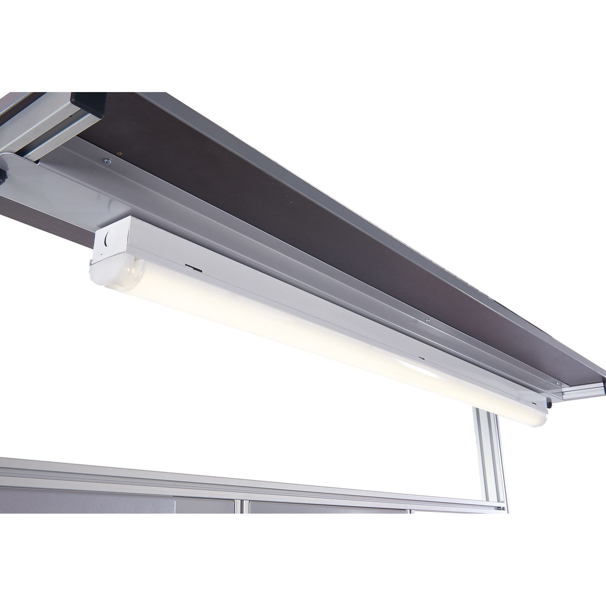

#### Magnification lens and spot light
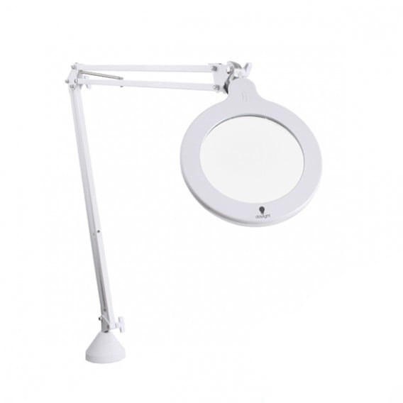

#### Bench Multimeter (Voltcraft VC-7055BT)
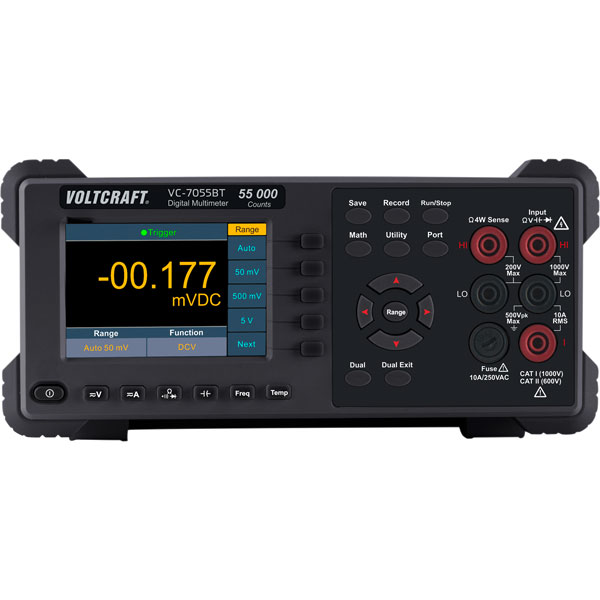

#### Oscilloscope (Voltcraft DSO-1102D)
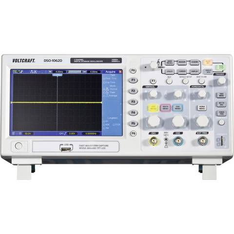

#### Bench Power Supply (Voltcraft PPS-13610)

#### Signal Generator (Voltcraft FG-1302)
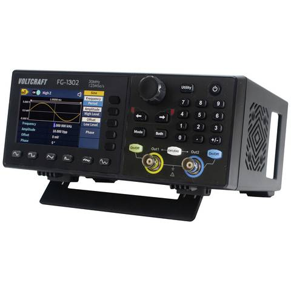

#### Wire solder tip cleaner (Hakko 599B)
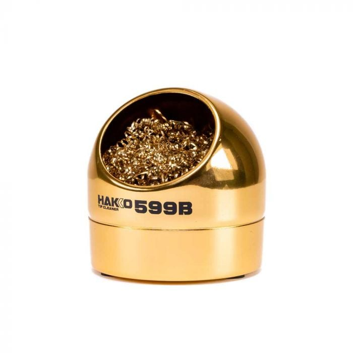

### On each of the 2 soldering stations:

#### Refillable Flux Pen
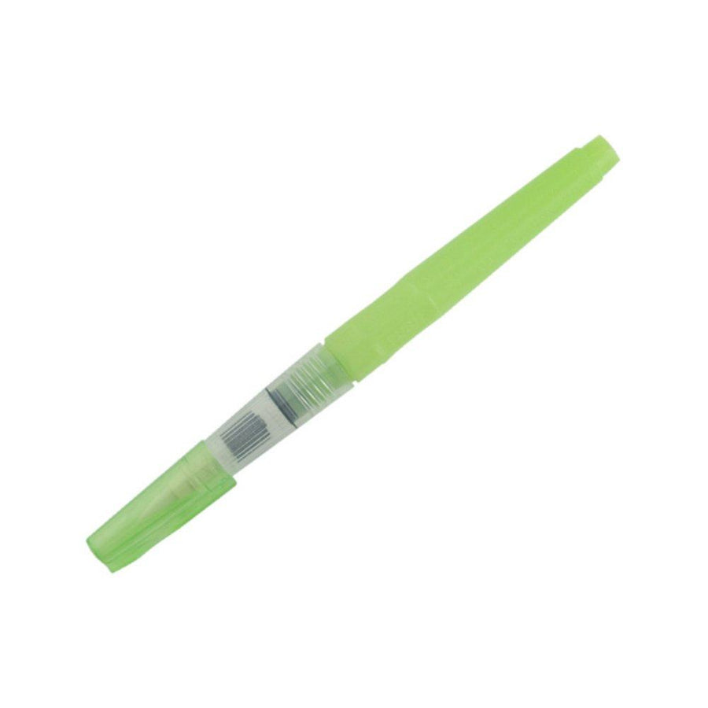

#### Third Hand (Omnifixo)
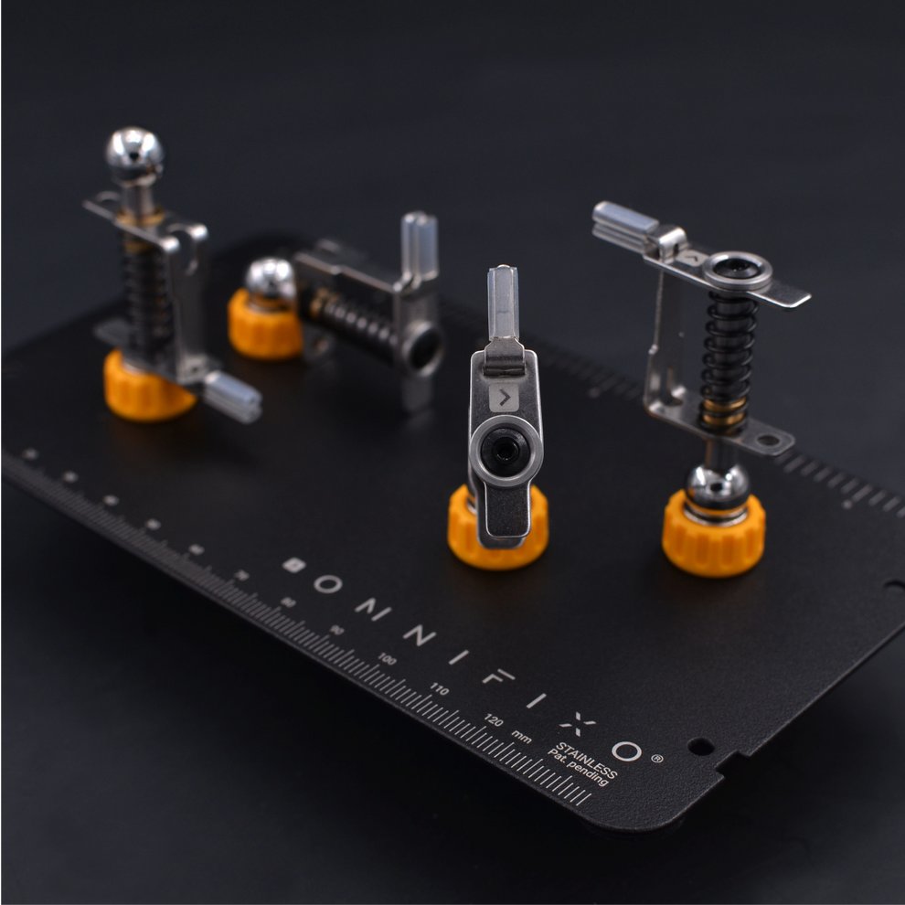

#### Glass-fibre Heat-proof brazing mat
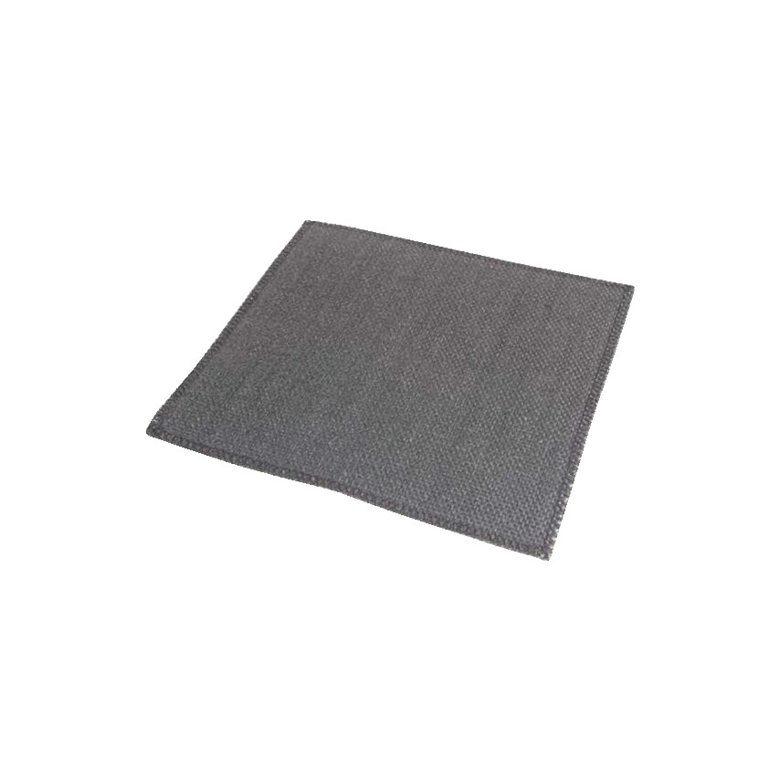

#### Soldering Iron (Hakko FX-951)
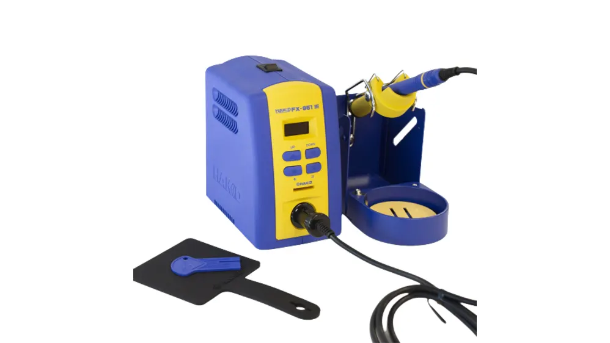

Also may have:

#### Hot-Air Reflow Station (Hakko FR-810B)
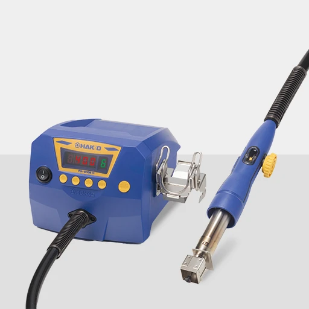

#### De-soldering Gun (Hakko FR-301)
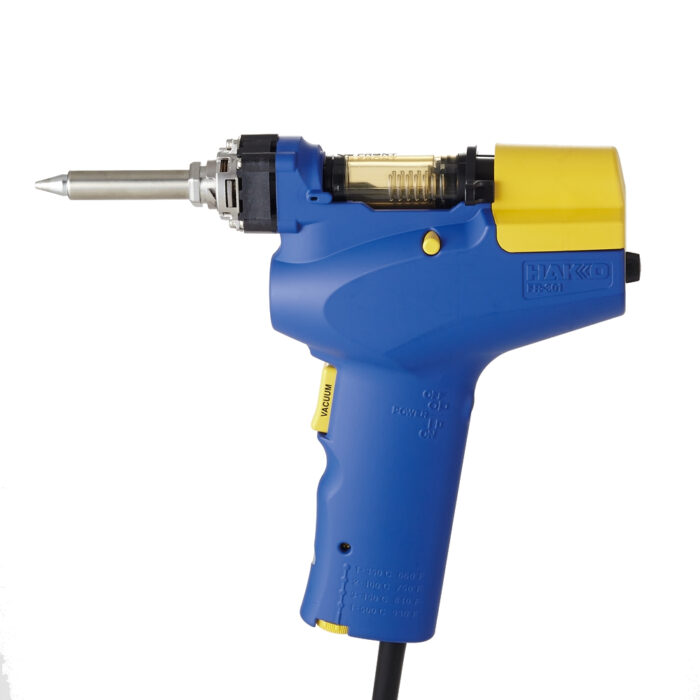

# Induction Activities

## 1. Thru-Hole Soldering

Through-hole soldering is joining components to a PCB by passing their leads through holes and soldering them to pads. In this activity you will solder a resistor to a matrixboard/protoboard.

### Operating the Soldering Iron

- Switch on the soldering iron station with the switch on top.
- You should not need to increase the temperature during this session. If a future task needs a higher setting, get the technician's approval and the FX-951 control card (key) before adjusting it:
  1. Insert the control card into the slot on the front of the station. The leftmost digit will blink.
  2. Use the UP or DOWN button to set the blinking digit, then press the * button to move to the next digit.
  3. Repeat for all three digits, then allow the station time to reach the new set temperature.

### Soldering Procedure

Before Soldering: 
- Extraction is on and working.
- Work area is clear of flammable materials & non-essential tools.
- Soldering iron sponge is wet.
- Soldering iron tip is shiny - clean and unoxidised.
- Appropriate soldering iron tip for the application is installed.
- Soldering iron temperature is set between 300-375°C. 
  
During Soldering:
- Put Soldering Iron in holder between activity.
- Periodically clean tip with moist sponge or brass tip cleaner.

After soldering or leaving the bench:
- Turn off soldering iron.
- Wash hands thoroughly.

### Thru-Hole Soldering technique

1. Check the component value and orientation, then insert its leads through the correct PCB holes.
2. Seat the component close to the board without forcing it. Bend the leads slightly outward on the solder side to hold it in place.
3. Place the board in the third hand and adjust the clips to hold it steady.
4. Apply a small amount of flux to the lead and pad.
5. Place the iron tip so it touches both the pad and the component lead. Hold it there briefly to heat both surfaces.
6. Feed solder into the heated joint, opposite the iron tip. Use only enough to form a small, continuous fillet around the lead and pad; do not feed solder onto the iron tip.
7. Remove the solder wire first, then the iron. Keep the component still until the joint has solidified.
8. Check that the solder wets both the pad and lead, and that there are no gaps, bridges to nearby pads, or loose component leads. Add a bit more flux, reheat and add a little solder if needed.
9. After the joint has cooled, trim excess lead with flush cutters. Hold the offcut so it cannot fly away.
10. Repeat for the remaining leads, then check the connections for shorts with a multimeter.
    
[Watch: Through-hole soldering](https://www.youtube.com/watch?v=DJH7VLGJ4fs)

### Soldering Troubleshooting

- If solder will not flow onto the joint, check that the iron is hot enough and its tip touches both the pad and lead. Add a small amount of flux and try again, you can never have too much flux!
- If solder will not wet the tip or the tip looks oxidised, stop and ask a technician for help. Only a technician may re-tin a soldering tip.
- If solder bridges adjacent pads, add a little flux and use the iron tip to draw the excess solder away. If needed, use solder wick or a solder sucker. Use the desoldering gun only as a last resort, and ask the technician if you are unsure.
- Avoid heating a pad for too long you may damage it. Let it cool before trying again, and ask for help if it still will not wet.

## 2. Wire-splicing

A linesman's (Western Union) splice joins two wires end-to-end forming a strong mechanical joint good enough that even NASA uses it. In this activity, you will join two pieces of green wire, solder the splice, and insulate it with heat-shrink tubing. 

### Linesman's splice technique

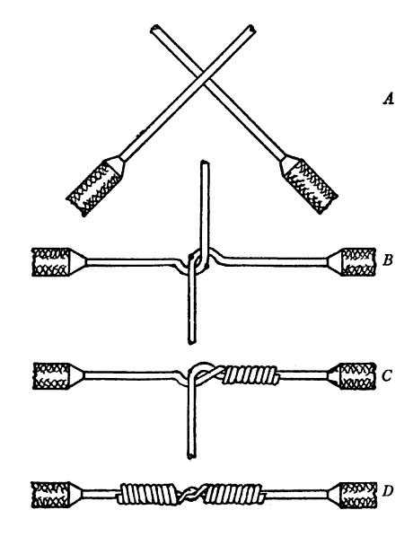

1. Cut a piece of heat-shrink tubing long enough to cover the splice and overlap the insulation by about 5-10 mm at both ends. Slide it onto one wire and park it well away from the joint.
2. Strip 2-3 cm of insulation from each wire end, taking care not to nick or cut the copper strands.
3. Cross the bare sections near their midpoints, as shown in the diagram.
4. Wrap one free end tightly around the other wire for several turns, working away from the crossing point.
5. Wrap the other free end tightly in the opposite direction. Keep the turns close together and tuck in any loose strands.
6. Place the splice in third hands and adjust the clips so the joint is held steady before soldering.
7. Apply a small amount of flux to the splice. Heat the conductors with the iron and feed solder into the joint until it flows through the wrapped strands. Do not melt solder directly onto the iron tip.
8. Remove the solder, then the iron. Keep the splice still while it cools, then inspect it and trim any sharp wire ends.
9. Centre the heat-shrink over the cooled splice so it overlaps the insulation at both ends.
10. Set the hot-air reflow station to the setting specified by the technician. Move the nozzle continuously around the tubing, rotating the wire so it shrinks evenly. Keep the hot-air gun in its holder when not in use.
11. Return the hot-air gun to its holder and let the tubing cool. Check that it fits snugly and covers all exposed copper, then verify continuity and check for shorts with a multimeter.

### Wire-splicing troubleshooting

- If the splice comes apart before soldering, redo the wraps so it holds together without support.
- If solder does not flow through the splice, check that the conductors are heated, add a small amount of flux, and try again.
- If the heat-shrink shrinks unevenly, keep the nozzle moving and rotate the wire. If it scorches, stop and ask a technician to check the station setting.
- If any copper remains exposed or strands are loose, replace the heat-shrink or redo the splice before using it.

## 3. 

